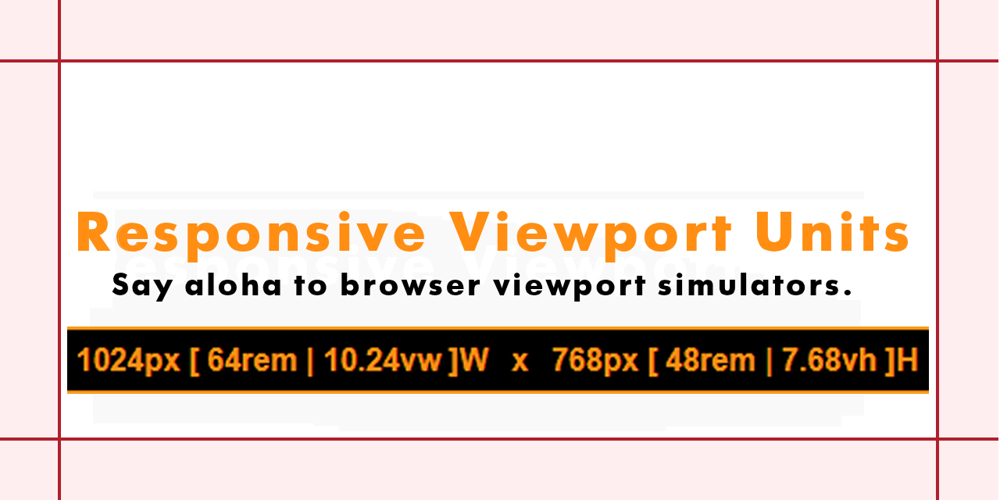

# <h1>Responsive Viewport Units</h1>
Responsive ViewPort Units generates and displays a browser's viewport unit values at the bottom of the page displayed within a browser's viewport each time a page is loaded and regenerates the unit values each time the browser is resized horizontally or vertically.
 

Help Me: <https://paypal.me/ClintonGallagher>

### <h3>About This Code</h3>
Responsive ViewPort Units was written using Classic JavaScript in 2017; exceptions noted as follows. The distro was developed as a WordPress plugin and can be installed as such. If wanted the script can be copied from the distro or by viewing source when installed and run on a WordPress site where the source code can be copied by viewing source and pasted into a &lt;script&gt; block in any HTML file by anybody with an interest in doing so.

The JavaScript source code is commented reasonably well and settings can be modified in WordPress or manually by touching the copied and pasted JavaScript itself as may be wanted or needed by those who have difficulty with the default black and gold color scheme. Similarly, the source code has been written to change the font size and text color to white on a black background when the browser is resized to a very small horizontal width so as to avoid brower chrome from obfuscating the generated output that is hard-coded to not wrap.

A 3rd party jQuery color picker was selected for use in WordPress Settings where color and positioning of the output can be configured. WordPress has been deprecating the use of jQuery but that will not prevent the code from being installed and generating output however WordPress configuration settings may no longer function and those who use this code will have to settle for the color and positioning  defaults; gold on black and white on black as shown above or further explained herein.

### <h3>Dependencies</h3>

- jQuery may be required for WordPress settings as noted.
- JavaScript **must** be enabled in the browser.
- Browsers **must** enable localStorage and cookies.

### <h3>Note:</h3>

Responsive Viewport Units has no known or discovered runtime errors per se and will run in any browser on a desktop that supports Classic JavaScript. The code may also run with browsers installed on tablets or mobile devices but this has not been widely tested when Responsive Viewport Units runs on tablets or mobile devices.

It has been discovered that the code **may not initially load** or **may not regenerate units** when the code is used with page builders and may also be subject to similar conflicts imposed by hosting service caching. Clearing cache and refreshing typically resolves these annoyances.

### <h3>Closing Comments</h3>

Responsive Viewport Units will free you of being distracted and wasting time and resources installing and toggling browser addon viewport unit simulators on and off. Generated viewport units will be present and positioned at the bottom of every page **in real-time** as you work on the development of your web pages. 

In aggregate, this code has saved me countless hours of time and frustration determining break points for media queries and resolving other matters when developing web page layouts.

But for conditions of the GPL license this code is distributed **free of any and all constraints or required monetary fees** and will remain so in perpetuity long after I am gone. All I ask is that you remember me in some way that I leave up to you to decide if and when you consider the monetary value of your time as you use this code to build your web pages...

Help Me: <https://paypal.me/ClintonGallagher>
